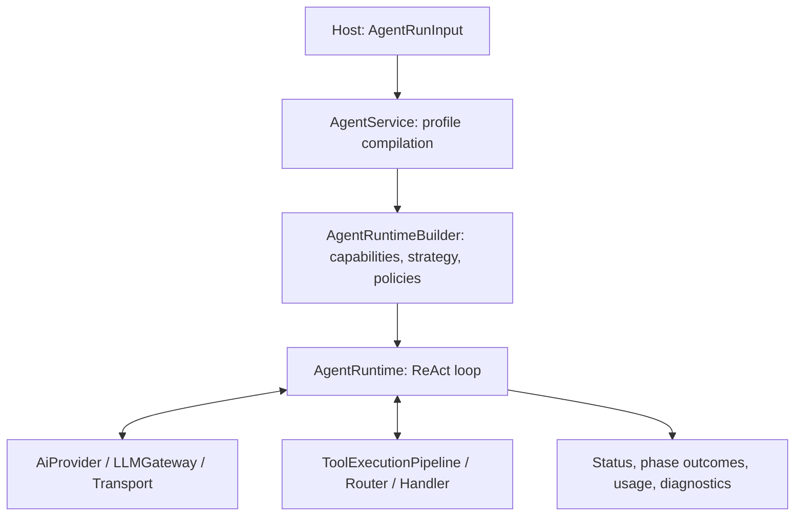

# @alembic/agent

English | [简体中文](README.zh-CN.md)

Alembic Agent is the standalone runtime package for Alembic's agent
orchestration: a single ReAct (Thought → Action → Observation) execution
engine, an AI provider/transport stack covering five vendors, and a
contract-first tool system — extracted from the Alembic product repository so
hosts can embed it through dependency injection.

- **TypeScript + ESM (NodeNext), Node >= 22**, formatted/linted with Biome.
- Deterministic capabilities (ProjectContext, knowledge persistence, dimension
  configs, logging) are **not** implemented here — they are consumed through
  the `@alembic/core` package entrypoints.

## What this package is / is not

**Is:**

- **Agent execution engine** — one `AgentRuntime` ReAct kernel plus Strategy
  orchestration, Policy constraints, Capability composition, and layered
  memory/context.
- **AI provider layer** — a unified `AiProvider` abstraction over OpenAI,
  Claude, Google Gemini, DeepSeek, and Ollama, with per-vendor transports,
  reliability control (retry / circuit breaker / concurrency / 429 cooldown),
  parameter guarding, and structured-output repair.
- **Tool system** — a single-source tool registry + `ToolRouter` + kernel
  contracts, with built-in `code` / `terminal` / `knowledge` / `graph` /
  `memory` / `meta` / `evidence` handlers, a terminal safety model, and output compression.

**Is not:**

- Not the Core deterministic kernel (lives in `@alembic/core`).
- Not the Dashboard UI (lives in `AlembicDashboard`).
- Not the Codex MCP / marketplace / plugin delivery shell (lives in
  `AlembicPlugin`). Hosts only construct an `AgentRunInput` and call the
  service layer.

These boundaries are pinned by frozen, executable manifests
(`AgentRuntimeResponsibility`, `AgentInterfaceContract`,
`AgentRuntimeBoundary`) and enforced by boundary lint gates (see
[Verification](#verification)).

## Architecture



Baseline presets (a profile declares capabilities, strategy, and policies;
`AgentProfileCompiler` compiles every profile input form into one
`CompiledAgentProfile`):

| Preset      | Capabilities            | Strategy          | Policies         |
| ----------- | ----------------------- | ----------------- | ---------------- |
| `chat`      | Conversation + Analysis | Single            | Budget (8 turns) |
| `insight`   | Analysis + Knowledge    | Pipeline          | Budget + Quality |
| `evolution` | Evolution analysis      | Pipeline          | Budget + Quality |

Domain runs (`src/agent/runs/`: plan, scan, evolution, relation, translation,
module mining) wrap the same service entrypoint with domain profiles and
result projections. `AgentRunCoordinator` handles fan-out: partition →
parallel child runs through `AgentService.run` itself → merge; child failures
become partial results instead of aborting the batch.

## Directory map

| Directory | Responsibility |
| --------- | -------------- |
| `src/agent/service/` | `AgentService` entrypoint, `AgentRuntimeBuilder` DI assembly, run contracts, system-run context factory |
| `src/agent/runtime/` | `AgentRuntime` ReAct kernel, `LoopContext`, `ExitController`, `BudgetController`, `ToolExecutionPipeline`, LLM input assembly/measurement, hooks/events/diagnostics, frozen interface contracts, PCV node evidence (observe-only) |
| `src/agent/profiles/` | Serializable profile definitions, `AgentProfileCompiler`, registries; `presets/` holds the runtime base blocks (chat/insight/evolution — Capability+Strategy+Policy compositions that stay out of serializable profiles by design) |
| `src/agent/strategies/` | `Single` / `FanOut` / `Pipeline` orchestration |
| `src/agent/policies/` | `PolicyEngine` with Budget / Safety / QualityGate policies |
| `src/agent/memory/` + `src/agent/evidence/` | Three-tier memory (`ActiveContext` working / `SessionStore` session / `PersistentMemory` SQLite semantic) coordinated by `MemoryCoordinator`, plus `EpisodicConsolidator`; `evidence/EvidenceCollector` supplies grounded evidence (`domain/` is now a thin re-export shell) |
| `src/agent/context/` | `ContextWindow` (staged progressive compression), `ExplorationTracker`, plan tracking, nudges |
| `src/agent/prompts/` + `src/agent/evaluation/` | `prompts/` holds persona/prompt text and retry/repair copy only; `evaluation/` holds the quality gates, analysis-artifact builders, gate evaluators, and pipeline stage builders split out of the old insightGate |
| `src/agent/runs/` + `coordination/` + `tasks/` | Domain runs, fan-out coordination, host task handlers |
| `src/ai/` | `AiProvider` abstraction, `LLMGateway`, per-vendor transports, `ModelRegistry`, reliability, `ParameterGuard`, structured output |
| `src/tools/` | Kernel contracts, `UnifiedToolCatalog`, runtime registry/router, handlers, terminal safety, output compressor + CLI parsers, `DeltaCache`; `runtime/toolsets/` packages scenario toolsets plus the `CapabilityRegistry` (key → toolset constructor) |

## Package exports

Subpath entrypoints (see `exports` in `package.json`): `.`, `./agent`,
`./service`, `./runtime`, `./prompts`, `./domain`, `./tasks`, `./profiles`,
`./ai`, `./tools/runtime`, `./memory`, `./context`, `./runs`, `./production`,
`./evaluation`. The last three are curated strict-production facades; internal
run families, prompts, stage/gate authority, judge calibration, fixtures, and
provider runners remain private.

Internal imports use the `#agent/*`, `#ai/*`, `#shared/*`, `#tools/*` aliases
(resolved to `src/` under the `alembic-dev` condition, `dist/` otherwise).

## Key runtime guarantees

Stage attempts, partial results, knowledge persistence receipts, and internal module boundaries
are documented in [Execution lifecycle](docs/execution-lifecycle.md).
See [Strict production contracts](docs/strict-production.md) for gate adapters, receipt layers,
and the host knowledge-management port requirements.

- **Structured execution results** — single-run execution
  errors are degraded into a complete `AgentRunResult` with a five-state
  status (success / blocked / aborted / timeout / error); the frozen
  `AgentInterfaceContract` pins the result branches, the ordinary-output
  policy, and the failure taxonomy.
- **Budget and exit control** — session-budget pressure triggers staged context compression; exhausted budgets, iteration limits, timeouts, and `ExitController` signals stop execution. A forced-summary fallback preserves
  available partial work; cancellation and timeouts suppress extra model summaries.
- **Tool safety** — `terminal` runs behind a global dangerous-command
  blocklist plus a read-only allowlist, sandboxed when available (audited on
  degradation); `code.write` enforces a read-before-write freshness (TOCTOU)
  gate backed by a view-scoped `DeltaCache`. File-version fingerprints are distinct
  from full-content visibility; host state is released at loop/run completion.
  See [tool host integration](docs/tool-host-integration.md) for ports and lifecycle contracts.
- **Observability first** — hooks, an event bus, a diagnostics collector, and
  the observe-only PCV node-evidence engine (grounding enforcement defaults to
  `off`); every fallback / degraded / retry path logs its trigger and choice.
- **Token discipline** — LLM input assembly is measured and budget-trimmed.
  Terminal output is ANSI-stripped before format parsing; generic fallback folds
  repeated lines. Parsers retain stderr and decline ambiguous or incomplete formats.
  Head/tail truncation includes its marker in the budget; structured search keeps
  complete evidence lines and reports omitted locations separately.

## Install & local development

Workspace development intentionally consumes Core through the adjacent source
checkout (local-source-first baseline):

```json
"@alembic/core": "file:../AlembicCore"
```

```bash
npm install
npm run build        # tsc -> dist/
npm test             # vitest run (mock providers; no real API keys required)
```

Runtime dependencies: `@alembic/core`, `better-sqlite3`, `drizzle-orm`,
`undici`.

## Verification

`npm run check` is the full gate chain: typecheck, Biome lint, and the
boundary/contract gates —

| Gate | Enforces |
| ---- | -------- |
| `lint:agent-import-boundary` / `lint:core-import-boundary` | package-entry imports only; no reaching into Core internals |
| `lint:public-api-boundary` + `smoke:public-signatures` | frozen public API surface and signatures |
| `smoke:strict-consumer` | plain-Node runtime and NodeNext type imports from the linked Alembic checkout; strict deep paths remain blocked |
| `lint:layer-contract` / `lint:space-edges` | layering and module-edge rules |
| `lint:doctrine` | side-effect doctrine — no import-time work, effects flow through injected ports (see `docs/side-effect-doctrine-census.md`) |
| `lint:naming` / `lint:retired-symbols` | naming rules; retired symbols stay dead |
| `verify:validation-floor` | minimum validation floor |
| `test` | vitest suite (`test/`), including interface-contract, terminal-safety, and PCV observe-only characterization/acceptance tests |

AI provider changes must pass with mock providers — tests never depend on real
API keys. Declared entrypoint side effects are pinned in
`docs/entrypoint-effects.md` and `test/entrypoint-effects.test.ts`.

See [LLM adapter contracts](docs/llm-adapters.md) for cancellation, schema validation, and SDK compatibility boundaries.

## Release

Publish previews are staged separately:

```bash
npm run release:pack-preview
```

`release:stage` builds and stages a publish package under `tmp/release/`; the
staged manifest replaces the local `file:../AlembicCore` dependency with the
registry `@alembic/core` version and records the Core source commit in
`.alembic-source.json`. `prepack` runs `release:package-guard`, so a raw
`npm pack` from the repo root cannot ship the development manifest.

## License

MIT

## Validation and host wiring

`npm run check` also runs the strict consumer against the real adjacent Alembic
installation. CI uses `npm run check:ci` for gates supported by its Agent/Core
checkout; the host probe requires a complete Alembic installation separately.
Builds clear this repository's generated `dist/` before compiling, so retired
source files cannot survive in a publish package.

Input validation, profile compilation, and assembly errors may throw before
runtime execution. Runtime cancellation, policy rejection, and terminal errors
are reflected in the service status. Pipeline outcomes and persisted candidate
readiness remain separate from that status. The system context factory creates
working memory by default; durable/session memory and strict production ports
must be wired by the host.
